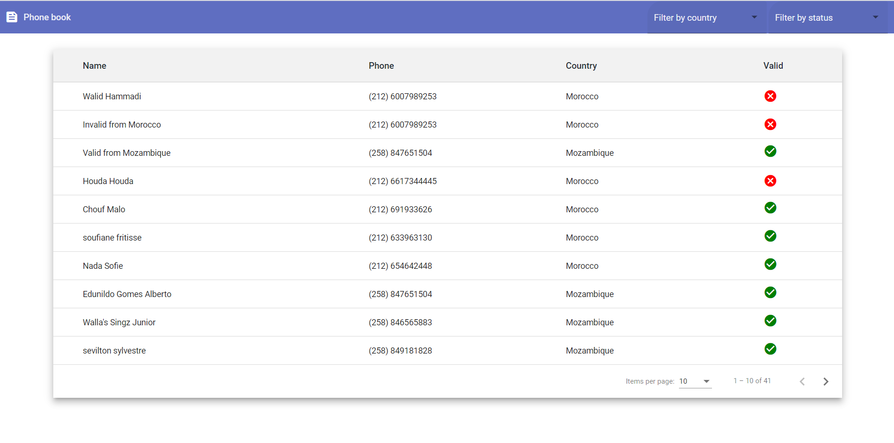
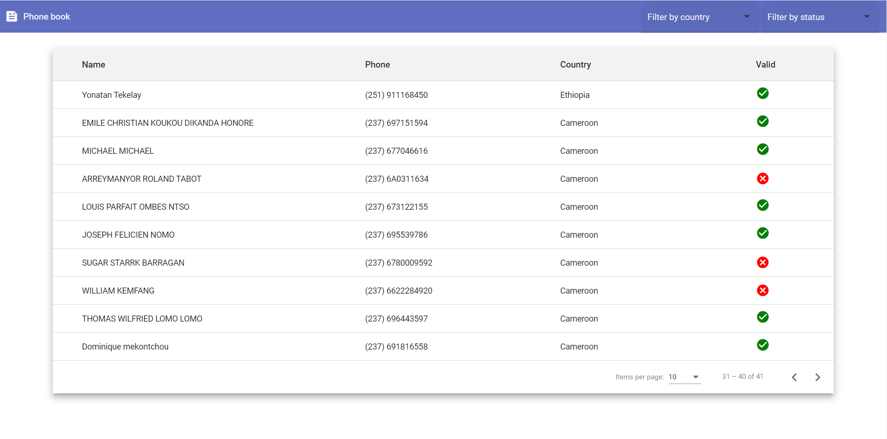
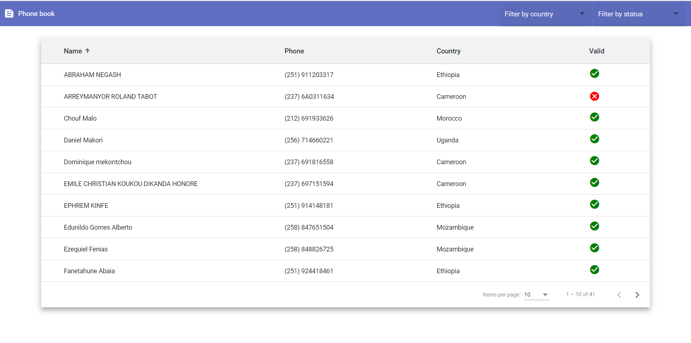
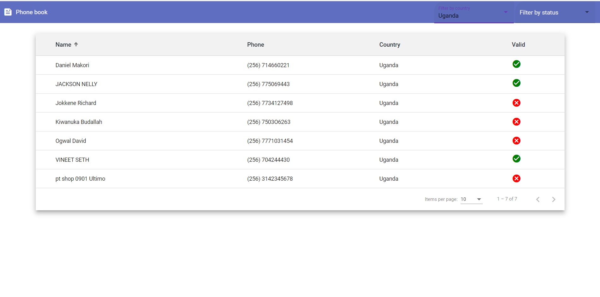
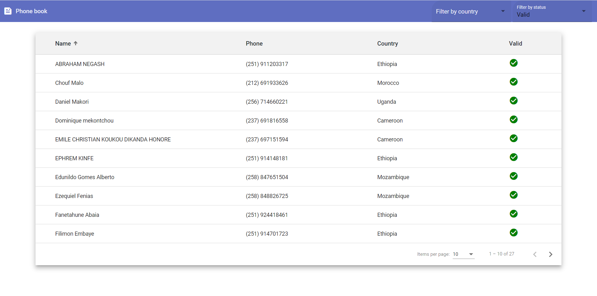
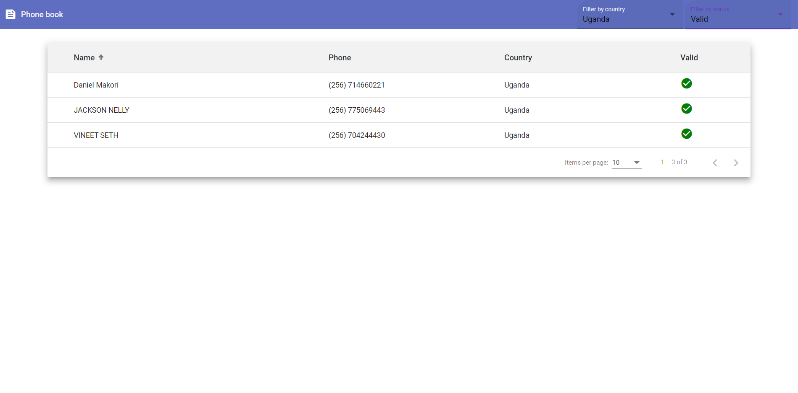

# Demo phone book project

This is a test project created for a skill showcase of a restful fullstack Web project

## Technologies & Frameworks used for development

Front end: Angular & Angular material.
Back-end: Spring Boot.

## Version info

Front End
* Angular CLI: 11.2.7
* Node: 14.16.0

Back End
* JDK: 1.8
* Spring boot: 2.4.4
* Maven: 3.6.3
* SQLite: 3.28.0
* JUnit: 4.12 (For unit tests)

## Task requirements

The task which this project tackles is a single-page web app to display a list of phone numbers, for which a set of rules were given to check & display phone number validity (state), as defined by the country code, and the phone number regex corresponding to each country.

* Implement Filtering by phone number validity, country, or both
* Implement Pagination & Sorting (bonus requirement)

## Available data

* An SQLite database containting a "customer" table with the columns " name | phone ".
* A set of harcoded rules for country codes, names, and regex (to check for phone number validity).

## Key Challenges

* Adapting Angular material mat-table pagination & sorting scheme (native to FE pagination) to server-side pagination & sort operations.
* Treating the database as unmodifiable, which created transient entity fields (e.g. validity & country names) that were checked server-side.

## Aditional frameworks used to enhance coding style and cleanliness

* Lombok (for getter & setter generation).
* Google Guava (For Lists initialization).

## Enhancement plan for existing code

* Using Swagger for Endpoint documentation and testing.

## How to run the project
### Front End
ng serve in /client
### Back End
Run Application.java
### Unit tests
Run CustomerInfoControllerTests.java

## Screen Shots

* Find all

* Pagination

* Sorting

* Filtering by Country

* Filtering by Validity

* Filtering by both Country & Validity

